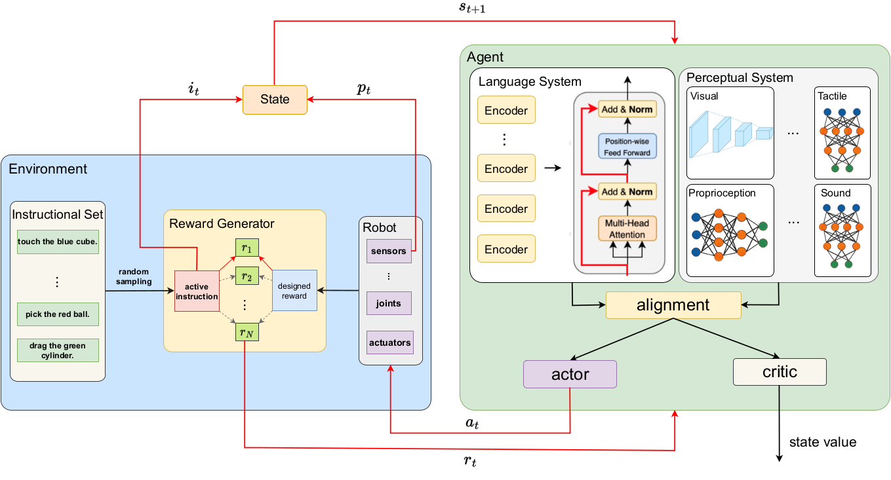
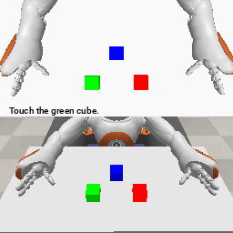
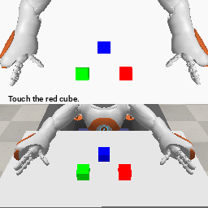

# InstructRobot: A Model-Free Framework for Mapping Natural Language Instructions into Robot Motion

Authors: Iury Cleveston, Esther L. Colombini

The ability to communicate with robots using natural language is a significant step forward in human-robot interaction. However, accurately translating verbal commands into physical actions is promising, but still presents challenges. Current approaches require large datasets to train the models and are limited to robots with a maximum of 6 degrees of freedom. To address these issues, we propose a framework called InstructRobot that maps natural language instructions into robot motion without requiring the construction of large datasets or prior knowledge of the robot's kinematics model. InstructRobot employs a reinforcement learning algorithm that enables joint learning of language representations and inverse kinematics model, simplifying the entire learning process. The proposed framework is validated using a complex robot with 26 revolute joints in object manipulation tasks, demonstrating its robustness and adaptability in realistic environments. The framework can be applied to any task or domain where datasets are scarce and difficult to create, making it an intuitive and accessible solution to the challenges of training robots using linguistic communication. 

### Experimental Results

The experimental results are presented:

   

## Instalation

InstructRobot requires Python 3.8, PyTorch 1.3.1, Cuda 12.2, and Coppelia Simulator v4.2.

```bash
git clone
pip install -r requirements.txt
sudo apt-get install '^libxcb.*-dev' libx11-xcb-dev libglu1-mesa-dev libxrender-dev libxi-dev libxkbcommon-dev libxkbcommon-x11-dev
```

## Usage

To train a new model:
```bash
nohup xvfb-run --auto-servernum --server-num=1 -s "-screen 0 1024x768x24" python3 Main.py &
```

## Hardware Configuration

We trained our methods on:
  - Nvidia RTX 4090 with 24Gb;
  - Motherboard Asus Rog Strix Z790-A Gaming
  - Intel Core i7-13700KF CPU @ 5.4GHz
  - RAM Corsair DDR4 1x32 Gb @ 2666MHz
  - Disk Seagate Barracuda 2Tb
  - Operating System Ubuntu v22.04. 

## Citation
If you use this code and data in your research, please cite our arxiv paper:

Coming soon!
<!--
```
@article{cleveston2021ram,
  title={RAM-VO: Less is more in Visual Odometry},
  author={Cleveston, Iury and Colombini, Esther L},
  journal={arXiv preprint arXiv:2107.02974},
  year={2021}
}
```
-->
